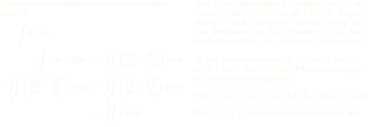

#### FONT:

*Krever pakken `fontspec` og recipes satt til xelatex*

~~~ tex
% MAINFONT:
% \setmainfont{FreeSans}
\setmainfont{SF Pro Display}

% MONOFONT:
\setmonofont{Iosevka Fixed Curly Extended}
% \setmonofont[medium]{Jetbrains Mono}
~~~

#### FONTSIZE:

~~~ tex
\scriptsize
\footnotesize
\tiny
\normalsize
\large
\Large
\LARGE
~~~

#### MATHMODE:

INLINE:

~~~ tex
$\int_{a}^{b}$
~~~

SENTRERT:

~~~ tex
$$\int_{a}^{b}
~~~

#### BRØKER:

~~~ tex
  $$\frac{1}{2}$$
~~~

  

#### ALIGN:

> lingningene blir linet opp etter `&` symbolet
> *align* er i mathmode
> *align* uten * viser "linjenummer" 

~~~ tex
\begin{align*}
    \oint\limits_C \vb{F} \cdot d\vb{r} = \qquad\qquad& \\
   -\oint\limits_C P dx + Q dy &= -\iint\limits_R \left(\pdv{Q}{x}-\pdv{P}{y}\right)dxdy\\
   -\iint\limits_R \left(\pdv{Q}{x}-\pdv{P}{y}\right)dxdy 
   &=-\iint\limits_R \left(\pdv{\frac{x}{2}}{x} + \pdv{\frac{y}{2}}{y}\right)dxdy   \\
    &=-\iint\limits_R 1 \; \text dx \text dy\\
\end{align*}
~~~

Minipage:

~~~ tex
\begin{minipage}[t]{.48\linewidth}
  % likningen over
\end{minipage}
\hspace{4mm}
\begin{minipage}[t]{.48\linewidth}
  % masse masse tekst
\end{minipage}
~~~

  

~~~ tex
\begin{figure}[!htb]
    \centering
    \resizebox{0.28\textwidth}{!}{\input{oppgave7.pdf_tex}}
\end{figure}
~~~

~~~ tex 
\entoure{\mintinline{python}{nearly_sorted_10000}} 
~~~

~~~ tex
\begin{minted}{matlab}
    function x = ranking(A)
        m = 0.1;
        n = size(A,1);
        S = ones(n) * 1/n;
        M = (1-m)*A + m*S;
        x = null(M - eye(n));
    end
\end{minted}
~~~

~~~ tex
\begin{tcolorbox}[halign title=center, box align=top, width=.22\linewidth]  
    \begin{enumerate}
        \item Side 1
        \item Side 4
        \item Side 3
        \item Side 2
    \end{enumerate}
\end{tcolorbox}
~~~

